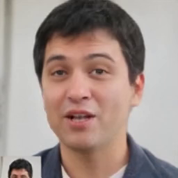
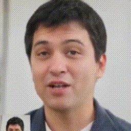
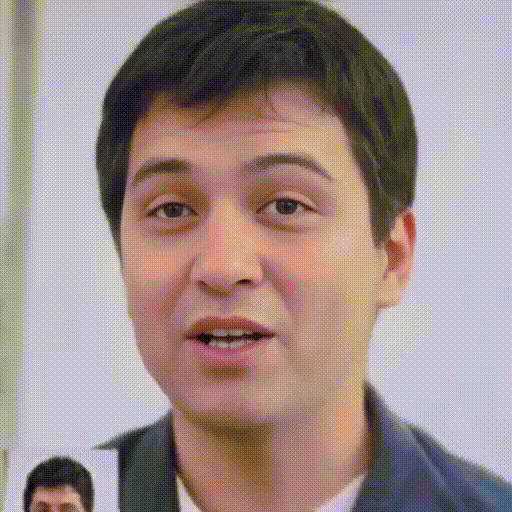
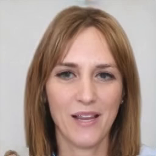

<!-- # EDTalk -->


### <div align="center">🚀 EDTalk: Efficient Disentanglement for Emotional Talking Head Synthesis</div> 


<p align="center">
  <a href="https://scholar.google.com.hk/citations?user=9KjKwDwAAAAJ&hl=en">Shuai Tan</a><sup>1</sup>,
  <a href="https://scholar.google.com.hk/citations?hl=zh-CN&user=uZeBvd8AAAAJ">Bin Ji</a><sup>1</sup>, 
  <a href="">Mengxiao Bi</a><sup>2</sup>, 
  <a href="">Ye Pan</a><sup>1</sup>, 
  <br><br>
  <sup>1</sup>Shanghai Jiao Tong University<br>
  <sup>2</sup>NetEase Fuxi AI Lab<br>
  <br>
<i><strong><a href='https://eccv2024.ecva.net/' target='_blank'>ECCV 2024</a></strong></i>
<br>
</p>


<br>

<div align="center">
  <a href="https://tanshuai0219.github.io/EDTalk/"></a> &ensp;
  <a href="https://arxiv.org/abs/2404.01647"></a> &ensp;

</div>

<div align="center">
  </img>
  <br>
</div>
<br>


## 🎏 Abstract
Achieving disentangled control over multiple facial motions and accommodating diverse input modalities greatly enhances the application and entertainment of the talking head generation. This necessitates a deep exploration of the decoupling space for facial features, ensuring that they <strong>a)</strong> operate independently without mutual interference and <strong>b)</strong> can be preserved to share with different modal inputs—both aspects often neglected in existing methods. To address this gap, this paper proposes a novel <strong>E</strong>fficient <strong>D</strong>isentanglement framework for <strong>Talk</strong>ing head generation (<strong>EDTalk</strong>). Our framework enables individual manipulation of mouth shape, head pose, and emotional expression, conditioned on both video and audio inputs. Specifically, we employ three <strong>lightweight</strong> modules to decompose the facial dynamics into three distinct latent spaces representing mouth, pose, and expression, respectively. Each space is characterized by a set of learnable bases whose linear combinations define specific motions. To ensure independence and accelerate training, we enforce orthogonality among bases and devise an <strong>efficient</strong> training strategy to allocate motion responsibilities to each space without relying on external knowledge. The learned bases are then stored in corresponding banks, enabling shared visual priors with audio input. Furthermore, considering the properties of each space, we propose Audio-to-Motion module for audio-driven talking head synthesis. Experiments are conducted to demonstrate the effectiveness of EDTalk.
## 💻 Overview
<div align="center">
  </img>
  <br>
</div>
<br>
<!-- Illustration of our proposed EDTalk. (a) EDTalk framework. Given an identity source $ I^i $ and various driving images $I^*$ ($ * \in \{m,p,e\} $) for controlling corresponding facial components, EDTalk animates the identity image $ I^i $ to mimic the mouth shape, head pose, and expression of $ I^m $, $ I^p $, and $ I^e $ with the assistance of three Component-aware Latent Navigation modules: MLN, PLN, and ELN.  (b) Efficient Disentanglement. The disentanglement process consists of two parts: Mouth-Pose decouple and Expression Decouple. For the former, we introduce the cross-reconstruction training strategy aimed at separating mouth shape and head pose. For the latter, we achieve expression disentanglement using self-reconstruction complementary learning. -->


## 🔥 Update
- 2024.07.31 - 💻 Add optional face super-resolution.
- 2024.07.19 - 💻 Release data preprocess codes and partial training codes (fine-tuning LIA & Mouth-Pose Decouple & Audio2Mouth). But I'm busy now and don't have enough time to clean up all the codes, but I think the current codes can be a useful reference if ones want to reproduce EDTalk or other. If you run into any problems, feel free to propose an issue!
- 2024.07.01 - 💻 The inference code and pretrained models are available.
- 2024.07.01 - 🎉 Our paper is accepted by ECCV 2024.
- 2024.04.02 - 🛳️ This repo is released.


## 📅 TODO

- [ ] **Release training code.**
- [x] **Release inference code.**
- [x] **Release pre-trained models.**
- [x] **Release Arxiv paper.**


## 🎮 Installation
We train and test based on Python 3.8 and Pytorch. To install the dependencies run:
```bash
git clone https://github.com/tanshuai0219/EDTalk.git
cd EDTalk
```

### Install dependency
```
conda create -n EDTalk python=3.8
conda activate EDTalk
```

- python packages
```
pip install -r requirements.txt
```


## 🎬 Quick Start

Download the [checkpoints](https://drive.google.com/file/d/1EKJXpq5gwFaRfkiAs6YUZ6YEiQ-8X3H3/view?usp=drive_link) and put them into ./ckpts.


### **EDTalk-A:lip+pose+exp**: Run the demo in audio-driven setting (EDTalk-A):
#### For user-friendliness, we extracted the weights of eight common sentiments in the expression base. one can directly specify the sentiment to generate emotional talking face videos (recommended)
  ```
  python demo_EDTalk_A_using_predefined_exp_weights.py --source_path path/to/image --audio_driving_path path/to/audio --pose_driving_path path/to/pose --exp_type type/of/expression --save_path path/to/save
  ```
  ****
#### Or you can input an expression reference (image/video) to indicate expression.

  ```
  python demo_EDTalk_A.py --source_path path/to/image --audio_driving_path path/to/audio --pose_driving_path path/to/pose --exp_driving_path path/to/expression --save_path path/to/save
  ```
  The result will be stored in save_path.

  **Source_path and videos used must be first cropped using scripts [crop_image2.py](data_preprocess/crop_image2.py) and [crop_video.py](data_preprocess/crop_video.py)**

  You can also use [crop_image.py](data_preprocess/crop_image.py) to crop the image, but [increase_ratio](https://github.com/tanshuai0219/EDTalk/blob/928fe3de7cf74b6a0e7db4ec90d59c85d79b8bc1/data_preprocess/crop_image.py#L76) has to be carefully set and tried several times to get the optimal result.
  <!-- For images where faces only make up a small portion of the image, we recommend using the [crop_image2.py](data_preprocess/crop_image2.py) to crop image. -->

****
### **EDTalk-A:lip+pose without exp**: If you don't want to change the expression of the identity source, please download the [EDTalk_lip_pose.pt](https://drive.google.com/file/d/1XkCWeph0LvQfpWb2mO4YhfUVE3qay71Z/view?usp=sharing) and put it into ./ckpts.

#### If you only want to change the lip motion of the identity source, run
  ```
   python demo_lip_pose.py --fix_pose --source_path path/to/image --audio_driving_path path/to/audio --save_path path/to/save
  ```
****
#### Or you can additionally control the head poses on top of the above via pose_driving_path
  ```
   python demo_lip_pose.py --source_path path/to/image --audio_driving_path path/to/audio --pose_driving_path path/to/pose --save_path path/to/save
  ```

#### And control the lip motion via a driven video.
  ```
   python demo_lip_pose_V.py --source_path path/to/image --audio_driving_path path/to/audio --lip_driving_path path/to/audio --pose_driving_path path/to/pose --save_path path/to/save
  ```
| Source Img | demo_lip_pose_V Results           | + FaceSR           |
|------------|--------------------------|---------------------------|
|</img> | <video controls loop src="https://github.com/user-attachments/assets/912097cf-ce92-42ca-960b-c4e0906cb0b0" muted="false"></video> |  <video controls loop src="https://github.com/user-attachments/assets/c4e1a81c-76c1-462a-b671-9c82e37e14ad" muted="false"></video> |
|</img> | <video controls loop src="https://github.com/user-attachments/assets/4e630594-1dd2-47fb-b367-6be7a700c769" muted="false"></video> |  <video controls loop src="https://github.com/user-attachments/assets/f1a0b477-a120-47a5-b925-00af4ff09781" muted="false"></video> |


****
### Run the demo in video-driven setting (EDTalk-V):
  ```
  python demo_EDTalk_V.py --source_path path/to/image --lip_driving_path path/to/lip --audio_driving_path path/to/audio --pose_driving_path path/to/pose --exp_driving_path path/to/expression --save_path path/to/save
  ```
  The result will be stored in save_path.


## Face Super-resolution (Optional)

☺️🙏 Thanks to [Tao Liu](https://github.com/liutaocode) for the proposal~

The purpose is to upscale the resolution from 256 to 512 and address the issue of blurry rendering.

Please install addtional environment here:

```
pip install facexlib
pip install tb-nightly -i https://mirrors.aliyun.com/pypi/simple
pip install gfpgan
```


Then enable the option `--face_sr` in your scripts. The first time will download the weights of gfpgan (you can optionally first download [gfpgan ckpts](https://drive.google.com/file/d/1SEWp_lnvxTHI1EIzurbNGYbPABmxih8A/view?usp=sharing) and put them in gfpgan/weights dir).

Here are some examples:

  ```

  python demo_lip_pose.py --source_path path/to/image --audio_driving_path path/to/audio --pose_driving_path path/to/pose --save_path path/to/save --face_sr

  python demo_EDTalk_V.py --source_path path/to/image --lip_driving_path path/to/lip --audio_driving_path path/to/audio --pose_driving_path path/to/pose --exp_driving_path path/to/expression --save_path path/to/save --face_sr

  python demo_EDTalk_A_using_predefined_exp_weights.py --source_path path/to/image --audio_driving_path path/to/audio --pose_driving_path path/to/pose --exp_type type/of/expression --save_path path/to/save --face_sr
  ```

<!-- **Note:** Due to the limitations of markdown, we downsampled the results after facesr, which may be detrimental to video quality and smoothness, see the [results_by_facesr](res/results_by_facesr) for detailed results.

| Source Img | EDTalk Results           | EDTalk + FaceSR           |
|------------|--------------------------|---------------------------|
|</img> | </img> |  </img> |
|</img> | </img> |  </img>      |
|</img> | </img>  |   </img>     | -->


| Source Img | EDTalk Results           | EDTalk + FaceSR           |
|------------|--------------------------|---------------------------|
|</img> |<video controls loop src="https://github.com/user-attachments/assets/f450414f-e272-49eb-a39e-0ffcb9269470" muted="false"></video> |  <video controls loop src="https://github.com/user-attachments/assets/6ad42d0b-6c3d-498b-b16f-0bb0fc7699b7" muted="false"></video> |
|</img> | <video controls loop src="https://github.com/user-attachments/assets/8ca59ada-507c-4d4e-a126-0e806582b4b6" muted="false"></video> |  <video controls loop src="https://github.com/user-attachments/assets/bccea19d-513c-4c22-8c49-4aac7c7d49d0" muted="false"></video>      |
|</img> | <video controls loop src="https://github.com/user-attachments/assets/b75f5a6c-0d38-4dc2-bbfa-330290f098ba" muted="false"></video>  |   <video controls loop src="https://github.com/user-attachments/assets/644100c6-608e-4266-8b94-6b61880dddbe" muted="false"></video>     |


## 🎬 Data Preprocess for Training
**Note**: The functions provided are available, but one should adjust the way they are called, e.g. by modifying the path to the data. If you run into any problems, feel free to leave your problems!
- Download the MEAD and HDTF dataset:
1) **MEAD**. [download link](https://wywu.github.io/projects/MEAD/MEAD.html). 


    We only use *Front* videos and extract audios and orgnize the data as follows:

    ```text
    /dir_path/MEAD_front/
    |-- Original_video
    |   |-- M003#angry#level_1#001.mp4
    |   |-- M003#angry#level_1#002.mp4
    |   |-- ...
    |-- audio
    |   |-- M003#angry#level_1#001.wav
    |   |-- M003#angry#level_1#002.wav
    |   |-- ...
    ```


2) **HDTF**. [download link](https://github.com/MRzzm/HDTF).

    We orgnize the data as follows:

    ```text
    /dir_path/HDTF/
    |-- audios
    |   |-- RD_Radio1_000.wav
    |   |-- RD_Radio2_000.wav
    |   |-- ...
    |-- original_videos
    |   |-- RD_Radio1_000.mp4
    |   |-- RD_Radio2_000.mp4
    |   |-- ...
    ```

- Crop videos in training datasets:
    ```bash
    python data_preprocess/data_preprocess_for_train/crop_video_MEAD.py
    python data_preprocess/data_preprocess_for_train/crop_video_HDTF.py
    ```
- Split video: Since the video in HDTF is too long, we split both the video and the corresponding audio into 5s segments:
    ```bash
    python data_preprocess/data_preprocess_for_train/split_HDTF_video.py
    ```

    ```bash
    python data_preprocess/data_preprocess_for_train/split_HDTF_audio.py
    ```

- We save the video frames in a lmdb file to improve I/O efficiency:
    ```bash
    python data_preprocess/data_preprocess_for_train/prepare_lmdb.py
    ```

- Extract mel feature from audio:
    ```bash
    python data_preprocess/data_preprocess_for_train/get_mel.py
    ```
- Extract landmarks from cropped videos:
    ```bash
    python data_preprocess/data_preprocess_for_train/extract_lmdk.py
    ```
- Extract bboxs from cropped videos for lip discriminator using [extract_bbox.py](https://github.com/yuangan/EAT_code/blob/main/preprocess/extract_bbox.py) and we give an unclean example using lmdb like :
    ```bash
    python data_preprocess/data_preprocess_for_train/extract_bbox.py
    ```

- After the preprocessing, the data should be orgnized as follows:
    ```text
    /dir_path/MEAD_front/
    |-- Original_video
    |   |-- M003#angry#level_1#001.mp4
    |   |-- M003#angry#level_1#002.mp4
    |   |-- ...
    |-- video
    |   |-- M003#angry#level_1#001.mp4
    |   |-- M003#angry#level_1#002.mp4
    |   |-- ...
    |-- audio
    |   |-- M003#angry#level_1#001.wav
    |   |-- M003#angry#level_1#002.wav
    |   |-- ...
    |-- bbox
    |   |-- M003#angry#level_1#001.npy
    |   |-- M003#angry#level_1#002.npy
    |   |-- ...
    |-- landmark
    |   |-- M003#angry#level_1#001.npy
    |   |-- M003#angry#level_1#002.npy
    |   |-- ...
    |-- mel
    |   |-- M003#angry#level_1#001.npy
    |   |-- M003#angry#level_1#002.npy
    |   |-- ...

    /dir_path/HDTF/
    |-- split_5s_video
    |   |-- RD_Radio1_000#1.mp4
    |   |-- RD_Radio1_000#2.mp4
    |   |-- ...
    |-- split_5s_audio
    |   |-- RD_Radio1_000#1.wav
    |   |-- RD_Radio1_000#2.wav
    |   |-- ...
    |-- bbox
    |   |-- RD_Radio1_000#1.npy
    |   |-- RD_Radio1_000#2.npy
    |   |-- ...
    |-- landmark
    |   |-- RD_Radio1_000#1.npy
    |   |-- RD_Radio1_000#2.npy
    |   |-- ...
    |-- mel
    |   |-- RD_Radio1_000#1.npy
    |   |-- RD_Radio1_000#2.npy
    |   |-- ...

    ```
## 🎬 Start Training
- Pretrain Encoder $E$ and Generator $G$:

    - Please refer to [LIA](https://github.com/wyhsirius/LIA) to train from scratch.
    - (Optional) If you want to accelerate convergence speed, you can download the pre-trained model of [LIA](https://github.com/wyhsirius/LIA).
    - we provide training code to fine-tune the model on MEAD and HDTF dataset:
    ```bash
    python -m torch.distributed.launch --nproc_per_node=2 --master_port 12345 train/train_E_G.py
    ```

- Train Mouth-Pose Decouple module:
    ```bash
    python -m torch.distributed.launch --nproc_per_node=2 --master_port 12344 train/train_Mouth_Pose_decouple.py
    ```
<!-- - Train Expression Decouple module:
    ```bash
    python -m torch.distributed.launch --nproc_per_node=2 --master_port 12344 train/train_Expression_decouple.py
    ``` -->
- Train Audio2Mouth module:
    ```bash
    python -m torch.distributed.launch --nproc_per_node=2 --master_port 12344 train/train_audio2mouth.py
    ```

## 👨‍👩‍👧‍👦 Other Talking head papers:

[ICCV 23] [EMMN: Emotional Motion Memory Network for Audio-driven Emotional Talking Face Generation](http://openaccess.thecvf.com/content/ICCV2023/html/Tan_EMMN_Emotional_Motion_Memory_Network_for_Audio-driven_Emotional_Talking_Face_ICCV_2023_paper.html)

[AAAI 24] [Style2Talker: High-Resolution Talking Head Generation with Emotion Style and Art Style](https://ojs.aaai.org/index.php/AAAI/article/view/28313)

[AAAI 24] [Say Anything with Any Style](https://ojs.aaai.org/index.php/AAAI/article/view/28314)

[CVPR 24] [FlowVQTalker: High-Quality Emotional Talking Face Generation through Normalizing Flow and Quantization](https://openaccess.thecvf.com/content/CVPR2024/html/Tan_FlowVQTalker_High-Quality_Emotional_Talking_Face_Generation_through_Normalizing_Flow_and_CVPR_2024_paper.html)


## 🎓 Citation

```
@article{tan2024edtalk,
  title={EDTalk: Efficient Disentanglement for Emotional Talking Head Synthesis},
  author={Tan, Shuai and Ji, Bin and Bi, Mengxiao and Pan, Ye},
  journal={arXiv preprint arXiv:2404.01647},
  year={2024}
}
```

## 🙏 Acknowledgement
Some code are borrowed from following projects:
* [LIA](https://github.com/wyhsirius/LIA)
* [DPE](https://github.com/OpenTalker/DPE)
* [PD-FGC](https://github.com/Dorniwang/PD-FGC-inference)
* [Wav2Lip](https://github.com/Rudrabha/Wav2Lip)
* [FOMM video preprocessing](https://github.com/AliaksandrSiarohin/video-preprocessing)

Some figures in the paper is inspired by:
* [PD-FGC](https://arxiv.org/abs/2211.14506)
* [DreamTalk](https://arxiv.org/abs/2312.09767)


Thanks for these great projects.
